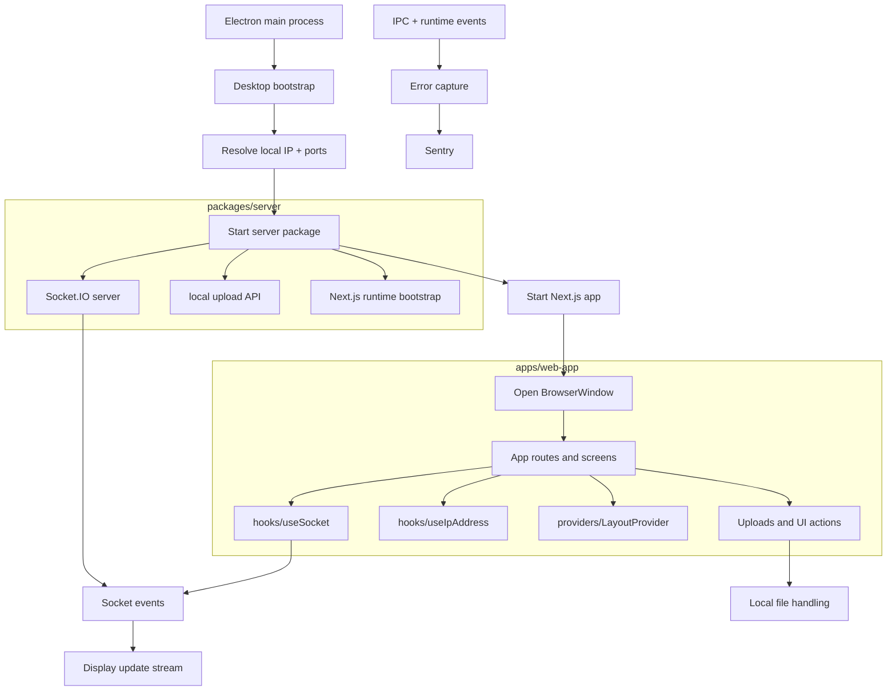

# Pinnacle

Pinnacle is a local projection control app built as a monorepo with an Electron desktop shell, a Next.js web app, a shared server package, and shared utilities. It is designed to run on a local network where one device acts as the control interface and another device renders the active image.

## Current status

This repository is organized as a multi-package workspace and is actively used for local development and packaging.

The main flow is:

- Electron launches the desktop shell
- the web app renders the control and display UI
- the server package runs Socket.IO and local API endpoints
- uploaded assets are stored locally and served over the app runtime
- local IP and port discovery are handled dynamically
- Sentry captures browser and Electron runtime exceptions

## What the app does

### Control panel

The main UI allows a user to:

- upload one or more images
- reorder and manage assets
- select the active display image
- navigate between images
- push updates to a connected display client

### Display view

The display-side view subscribes to the Socket.IO stream and renders the latest image from the controller.

### Network behavior

The app is designed for a LAN environment. It discovers the local machine IP and resolves active ports at runtime, then broadcasts changes to the renderer when the network state changes.

## Architecture



## Project structure

```text
.
├── .github/
│   └── workflows/
│       └── build.yml
├── apps/
│   ├── desktop/
│   │   ├── dist/
│   │   ├── electron/
│   │   ├── build-electron.mjs
│   │   ├── entitlements.plist
│   │   ├── forge.config.mjs
│   │   ├── package.json
│   │   └── tsconfig.json
│   └── web-app/
│       ├── app/
│       ├── hooks/
│       ├── providers/
│       ├── public/
│       ├── AGENTS.md
│       ├── CLAUDE.md
│       ├── next.config.ts
│       ├── next-env.d.ts
│       ├── package.json
│       ├── postcss.config.mjs
│       └── tsconfig.json
├── packages/
│   ├── server/
│   │   ├── src/
│   │   ├── esbuild.config.ts
│   │   ├── index.ts
│   │   ├── package.json
│   │   └── tsconfig.json
│   ├── shared-types/
│   │   ├── electron.d.ts
│   │   ├── index.js
│   │   ├── index.ts
│   │   ├── package.json
│   │   └── tsconfig.json
│   └── utils/
│       ├── src/
│       ├── package.json
│       └── tsconfig.json
├── README.md
├── eslint.config.mjs
├── package.json
├── tsconfig.json
├── turbo.json
└── yarn.lock
```

## Monorepo scripts

From the root workspace:

```bash
yarn install

yarn dev
yarn build
yarn make
yarn electron-publish
yarn typecheck
yarn lint
```

### Script behavior

- `yarn dev` runs the project development flow through Turbo
- `yarn build:web-app` builds the web app
- `yarn build:server` builds the server package
- `yarn build:desktop` builds the desktop app
- `yarn build` runs the full app build sequence
- `yarn make` builds and packages the desktop app with Electron Forge
- `yarn electron-publish` builds and publishes the app with Forge

## Desktop app details

The desktop package is located in [apps/desktop](apps/desktop) and is configured with Electron Forge. Its entry points are in [apps/desktop/electron](apps/desktop/electron), and it uses the build script in [apps/desktop/build-electron.mjs](apps/desktop/build-electron.mjs).

Key desktop files:

- [apps/desktop/electron/main.ts](apps/desktop/electron/main.ts)
- [apps/desktop/electron/helper.ts](apps/desktop/electron/helper.ts)
- [apps/desktop/electron/ipcHandlers.ts](apps/desktop/electron/ipcHandlers.ts)
- [apps/desktop/forge.config.mjs](apps/desktop/forge.config.mjs)

## Web app details

The frontend is in [apps/web-app](apps/web-app) and is built with Next.js.

Important areas:

- [apps/web-app/app](apps/web-app/app)
- [apps/web-app/hooks](apps/web-app/hooks)
- [apps/web-app/providers](apps/web-app/providers)
- [apps/web-app/public](apps/web-app/public)

## Shared packages

### Server package

The server package in [packages/server](packages/server) contains the local runtime, upload endpoints, and Socket.IO server logic.

### Utils package

The utilities package in [packages/utils](packages/utils) contains shared logging and Sentry helpers such as:

- [packages/utils/src/logger.ts](packages/utils/src/logger.ts)
- [packages/utils/src/logger-core.ts](packages/utils/src/logger-core.ts)
- [packages/utils/src/sentry-config.ts](packages/utils/src/sentry-config.ts)
- [packages/utils/src/sentry-report.ts](packages/utils/src/sentry-report.ts)

## Local development

### Requirements

- Node.js
- Yarn
- macOS, Windows, or Linux host runtime supported by Electron

### Install dependencies

```bash
yarn install
```

### Run the app locally

```bash
yarn dev
```

### Build all workspaces

```bash
yarn build
```

### Package the desktop app

```bash
yarn make
```

### Publish desktop release

```bash
yarn electron-publish
```

## Environment and runtime notes

### Ports

The app resolves ports dynamically at startup, with the server and frontend using fallback values when defaults are occupied.

### Local networking

The app discovers the local IP address and uses it to keep the control and display surfaces connected on the same LAN.

### Logging and Sentry

- shared logging helpers live in the utilities package
- Sentry is initialized for the Electron shell and browser runtime
- runtime exceptions and unhandled errors are captured for diagnostics

## Contribution notes

This project is intentionally split along clear boundaries:

- desktop shell and runtime startup
- web UI and route logic
- server package for local APIs and realtime transport
- shared utilities and telemetry helpers

This keeps the app easy to reason about while still allowing rapid iteration on the UI and local network flow.

## License

MIT
