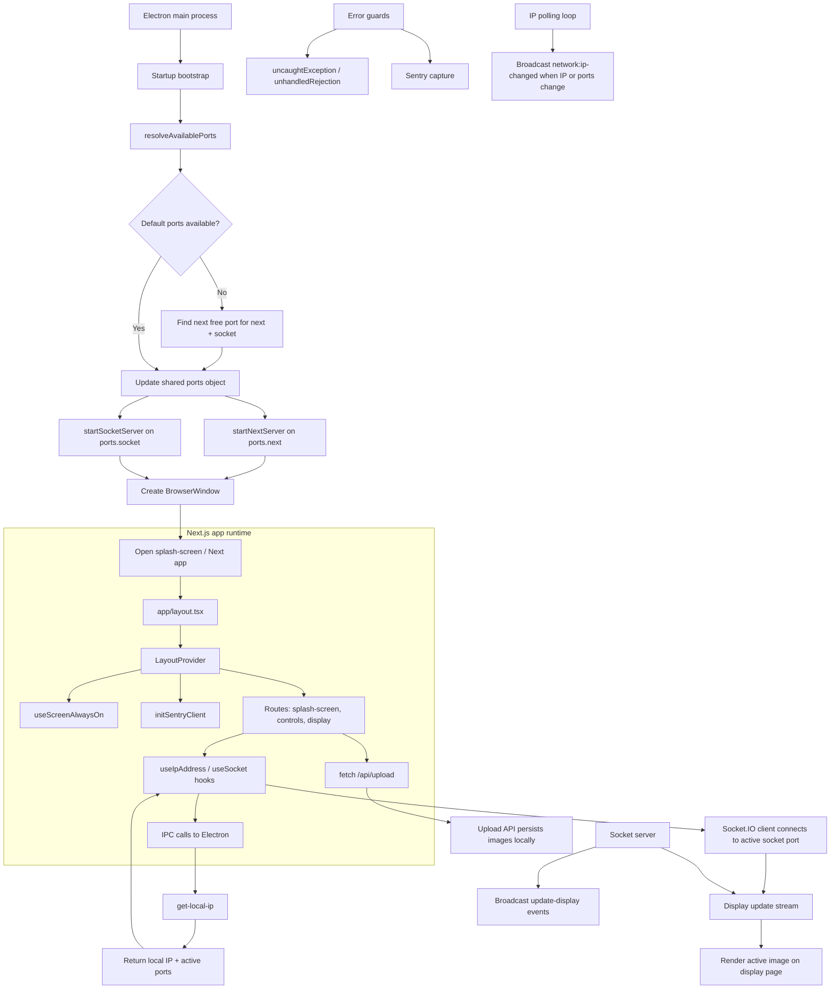

# Pinnacle

Pinnacle is a local projection control app built as an Electron shell around a Next.js frontend and a Socket.IO-driven display system. The app lets a control panel upload/manage image assets and push the active image to a display client running on the same local network.

## Current status

This project is in active local-development / prototype stage. The core flow is working:

- Electron boots the app shell
- a local Next.js server is started for the UI
- a Socket.IO server relays display updates between control and display clients
- image uploads are stored and served locally
- IP addresses and ports are discovered dynamically and broadcast to the renderer when they change
- Sentry error tracking is wired for browser and Electron runtime failures

## What it does

### Control panel

The UI allows a user to:

- upload multiple images
- reorder images
- select a display image
- move through images with previous/next controls
- trigger updates to the connected display

### Display view

The display-side page subscribes to the Socket.IO stream and renders the latest image pushed from the controller.

### Network behavior

The app is designed to operate on a LAN, using the local machine IP plus dynamic ports for the Next.js web app and Socket.IO server. If the default ports are already occupied, the app resolves a fallback port and updates listeners.

## Architecture



## Project structure

```text
.
├── app/
│   ├── controls/
│   ├── splash-screen/
│   ├── globals.css
│   ├── layout.tsx
│   └── page.tsx
├── electron/
│   ├── helper.js
│   ├── ipcHandlers.js
│   ├── main.js
│   ├── preload.js
│   ├── sentry.js
│   ├── utils.js
│   └── main.js
├── hooks/
│   ├── useIpAddress.ts
│   ├── useLogger.ts
│   ├── useScreenAlwaysOn.tsx
│   └── useSocket.tsx
├── lib/
│   ├── logger-core.js
│   ├── logger.ts
│   ├── sentry-client.ts
│   ├── sentry-config.js
│   └── sentry-report.js
├── providers/
│   └── LayoutProvider.tsx
├── server/
│   ├── api/
│   ├── next-server.js
│   ├── socket-dev.js
│   └── socket-server.js
├── public/
├── README.md
├── package.json
├── next.config.ts
├── tsconfig.json
├── eslint.config.mjs
├── forge.config.js
└── entitlements.plist
```

## Local development

### Requirements

- Node.js
- Yarn
- Electron runtime support for the host OS

### Install

```bash
yarn install
```

### Run the app in development mode

```bash
yarn electron-dev
```

This starts the socket server, waits for the Next.js app to come up, then launches the Electron shell.

### Run only the web app

```bash
yarn next-dev
```

### Build the app

```bash
yarn next-build
```

### Package / distribute

```bash
yarn package
# or
yarn make
```

## Environment and runtime notes

### Ports

The app resolves active ports dynamically at startup using a shared `ports` object.

- default Next port: `3000`
- default socket port: `1234`

If either is in use, the app finds the next free port and updates all listeners, including the renderer UI and IPC calls.

### Local networking

The app discovers the local IP address and exposes it through Electron IPC, so the UI can show the correct address in the browser window and connect to the local socket server.

### Logging and Sentry

- structured app logging is handled via `lib/logger-core.js`
- Sentry is initialized in Electron and browser contexts
- uncaught errors and rejected promises are captured to help diagnose runtime failures

## How the app flows in practice

1. Electron boots the app shell.
2. Available ports are resolved.
3. Next.js and Socket.IO servers are started on the active port values.
4. The browser loads the splash screen and app UI.
5. The control panel uploads images and emits display updates.
6. The display page receives Socket.IO events and updates the currently displayed image.
7. Local IP / port changes are broadcast to the rendering layer automatically.

## Known constraints / caveats

- This is a local-network app, not a public web deployment.
- Current functionality assumes the devices are on the same LAN.
- Images are stored in the local app data bucket and are not yet fully cloud-backed.
- The app is still evolving; UI polish and broader validation are ongoing.

## Contribution notes

This project is structured around a small Electron shell with a browser-based control surface and a lightweight realtime display layer. Most logic is intentionally split between:

- Electron bootstrap and runtime guards
- Next.js UI routes and hooks
- Socket.IO communication for live display updates
- local upload management and image processing

## License

MIT
